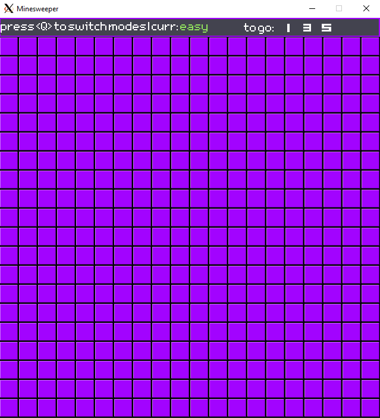
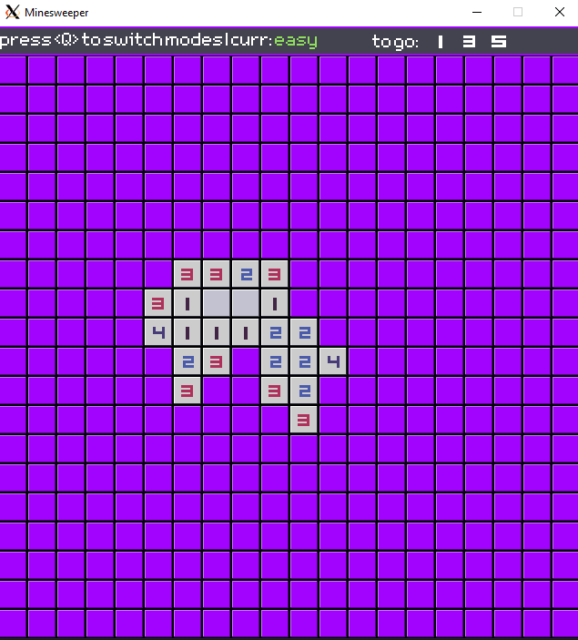
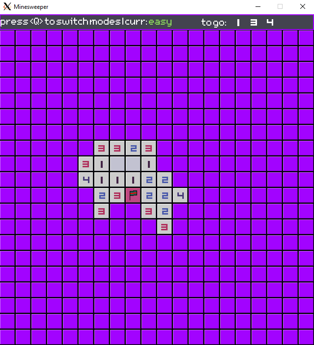
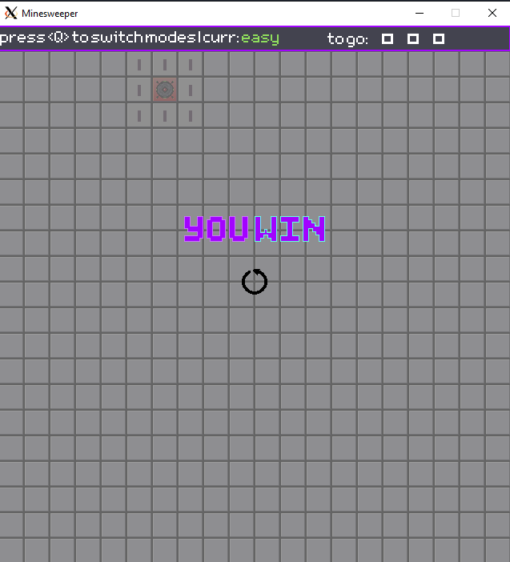
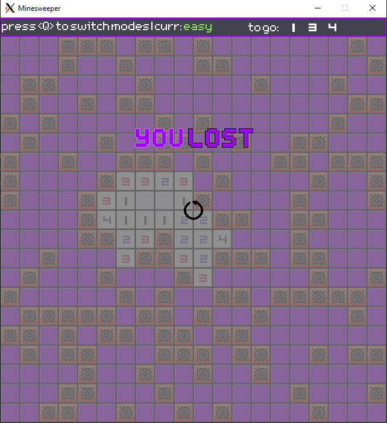
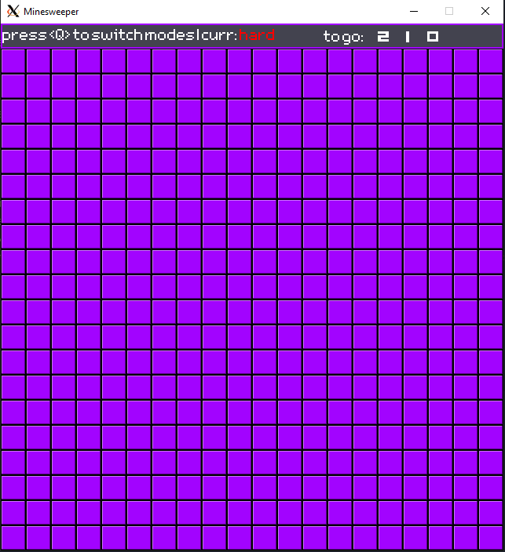

# Minesweeper

> Игра "Сапёр", реализованная на C++, используя компилятор g++ и фреймворк SFML.

# Как собрать проект:
## Windows:
> ---
## MscOS:
> ---
## Linux/WSL:
Для сборки проекта наберите в консоли:
```
chmod +x build.sh && ./build.sh
```

Для запуска проекта наберите в консоли:
```
./build/Minesweeper
```

Для запуска тестов наберите в консоли:
```
./build/test
```
## Что делать, если не удаётся запустить GUI приложение?
Если у вас установлена Windows 10 с WSL, или же ваша ОС не поддерживает GUI, выполните дальнейшие шаги:
* Установите [x сервер для Windows](https://sourceforge.net/projects/vcxsrv/), если ваша ОС - Windows 10/11.
    1. Открыв приложение XLaunch, выберите данные настройки:
        * Multiple windows
        * Start no client
        * Clipboard - `checked`, PrimarySlection - `checked`
        * Native opengl - `unchecked`
        * Disable access control - checked
* Изменение `resolv.conf` для изменения DNS адреса вашей машины:
    1. Через терминал наберите `sudo nano /etc/resolv.conf`. Скопируйте `[network]` и `generateResolvConf = false`. Измените значение `nameserver` на `1.1.1.1` или на `8.8.8.8`. Сохраните и выйдите.
    2. Через терминал наберите `sudo nano /etc/wsl.conf`. Вставьте скопированный текст и `[boot] systemd=true`.
* Расскоментируйте и измените значение `ForwardX11` и `ForwardX11Trusted` на `yes`, открыв и изменив файл `ssh_config`, набрав в терминале `sudo nano /etc/ssh/ssh_config`.
* Измените IP, по которому WSL\Debian-подобные ОС смогут распознать ваш дисплей, вставив в терминал:

    WSL2:
    ```
    export DISPLAY=$(ip route  | awk '/default via / {print $3; exit}' 2>/dev/null):0
    export LIBGL_ALWAYS_INDIRECT=1
    ```
    
    WSL1:
    ```
    export DISPLAY=localhost:0
    export LIBGL_ALWAYS_INDIRECT=1
    ```
При правильно выполненных действиях, программа должна запуститься, если не запустилась изначально.

## Управление
* Для открытия клетки используйте `LKM`
* Для проставления фалжка, который обозначает клетку, в которой потенциально находится мина используйте `PKM`
* Для смены режима нажмите `Q`
* Для обновления поля нажмите `R`

## Правила
Первый ход в игре безопасный, то есть при нажатии на любую клетку на поле, в ней гарантированно не будет мины.
В каждой клетке поле находится цифра - количество мин вокруг неё. Если клетка пустая, то мин рядом с клеткой нет.
После того, как будет поставлен флажок, то игра уменьшит число оставшихся мин. 
В конце игры когда число оставшихся мин будет равно нулю, то игра проверит все ли выделенные клетки являются минами. Если все флажки выставлены правильно, то появится экран выигрыша, если нет, то проигрыша.
Игру можно обновить в любой момент. Это сбросит все клетки к начальному состоянию и поле вновь заполнится рандомно.
Изменение режима игры также обновляет поле, добавляя или уменьшая количество мин.


## Скриншоты игры








